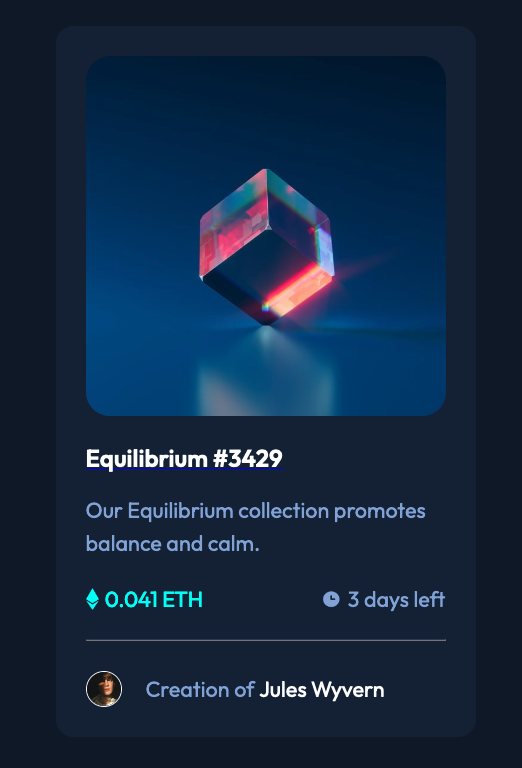

# Frontend Mentor - NFT preview card component solution

This is a solution to the [NFT preview card component challenge on Frontend Mentor](https://www.frontendmentor.io/challenges/nft-preview-card-component-SbdUL_w0U). Frontend Mentor challenges help you improve your coding skills by building realistic projects.

## Table of contents

- [Overview](#overview)
  - [The challenge](#the-challenge)
  - [Screenshot](#screenshot)
  - [Links](#links)
- [My process](#my-process)
  - [Built with](#built-with)
  - [What I learned](#what-i-learned)
  - [Continued development](#continued-development)
  - [Useful resources](#useful-resources)
- [Author](#author)
- [Acknowledgments](#acknowledgments)

**Note: Delete this note and update the table of contents based on what sections you keep.**

## Overview

### The challenge

Users should be able to:

- View the optimal layout depending on their device's screen size
- See hover states for interactive elements

### Screenshot

### Links

- Solution URL: [Frontend Mentor Solution](https://www.frontendmentor.io/solutions/mobile-design-using-css-flexbox-YBq0FkHjL)
- Live Site URL: [Live site URL](https://affectionate-brattain-3afb74.netlify.app//your-live-site-url.com)

## My process

### Built with

- Used Parcel builder
- Semantic HTML5 markup
- CSS custom properties
- Flexbox
- Mobile-first workflow

### What I learned

One thing I learned is there is some more to learn.

I kept having to remind myself that I am still learning and need to keep going and it will get "easier".

### Continued development

I want to get better at writing proper HTML and CSS. I know there are better ways to do things. I want to learn Responsive mobile first design. I want to be able to not "hack" css and understand what is actually happening.

### Useful resources

- [Discord](https://www.discord.com) - Discord was a great resource to ask questions and get help along the way.
- [Google](https://www.google.com) - Being able to google and get help when you are stuck is a great resource.

## Author

- Frontend Mentor - [@RonWaller](https://www.frontendmentor.io/profile/RonWaller)
- Twitter - [@ronjw1](https://www.twitter.com/ronjw1)

## Acknowledgments

[Kevin Powell](https://www.youtube.com/kepowob/featured) was a great help for me as I was struggling with CSS. I watched his Youtube videos to help me undestand and accomplish my solution.
